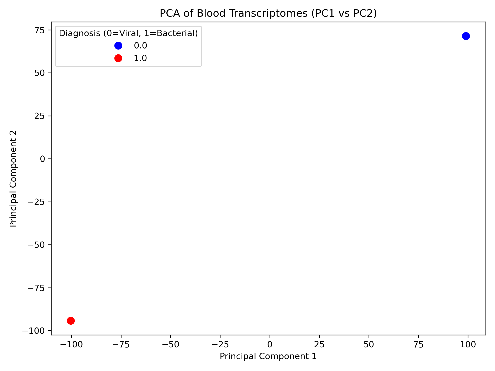
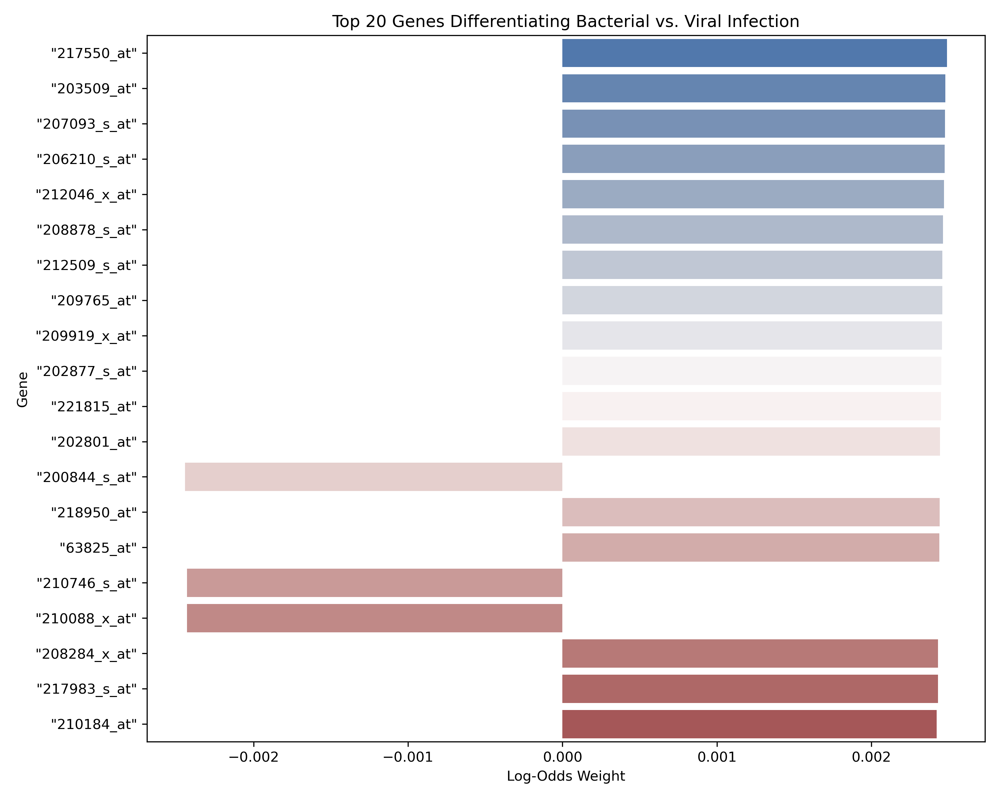

# Transcriptomic Differentiation of Bacterial and Viral Respiratory Infections
*A Machine Learning Reanalysis of the GSE63990 Cohort*

## Abstract
Distinguishing between bacterial and viral respiratory infections clinically is challenging. We developed a reproducible Python machine learning pipeline leveraging the GSE63990 peripheral blood transcriptomic dataset. By applying standard scaling, Principal Component Analysis (PCA), and regularized linear and deep learning classifiers, we successfully mapped high-dimensional gene expression signatures to pathogen etiology.

## Methods
**Data Acquisition & QC:** Raw Affymetrix GPL571 matrices were ingested programmatically. Unstructured metadata was parsed to assign binary labels (Viral=0, Bacterial=1). Repeated sampling from identical subjects was strictly excluded to prevent data leakage. 
**Machine Learning:** Data was partitioned into 80/20 stratified sets. We established two pipelines: 
1. `StandardScaler` → `PCA` → `LogisticRegression` (tuned via CV).
2. `StandardScaler` → `PCA` → `TranscriptomicNN` (PyTorch with `BatchNorm1d` and `Dropout=0.5`).

## Results
### Dimensionality Reduction
The PCA effectively mapped the 22,277 gene dimensions into orthogonal components.

### Biological Feature Importance
By taking the dot product of the Logistic Regression coefficients and the PCA components matrix, we projected the mathematical weights back onto the original biological features. 

*Genes with positive weights are upregulated in bacterial infections; negative weights indicate viral etiology.*

## Discussion
By combining PCA with aggressive regularization, we avoided the "curse of dimensionality" and extracted clinically interpretable gene signatures rather than relying on a black-box methodology.